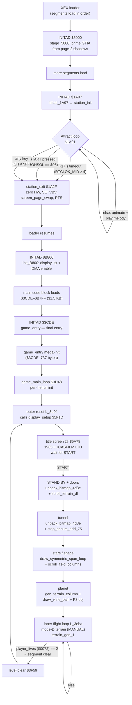

# Startup & control flow — boot → attract → main game loop

How *Rescue on Fractalus!* gets from power-on to the flight loop, reconstructed
from the disassembly (`disasm/listing.txt`) and the named C (`src/gen/rof_gen.c`).
Function names below match `disasm/symbols.csv`; addresses are the original
Atari 6502 addresses.

> **Port note.** On the real Atari the whole sequence is driven by the XEX
> loader running a chain of `INITAD` vectors (below). The SDL/C port in
> `src/main.cpp` currently **shortcuts straight to `game_entry()`** — it loads
> the post-load 64K image (`disasm/rof_mem.bin`) and calls the final entry point
> directly, so the loader chain and the load-time attract screen are bypassed.
> This document describes the *original* design first, then where the port
> diverges (see [§8](#8-how-the-c-port-enters)).

---

## 1. The big picture



> The launch cinematic — title → STAND BY → doors → tunnel → stars → planet
> (the `T … D4` nodes) — all runs **inside `display_setup` ($5F1D)**, only on a
> fresh start; on later resets `display_setup` just rebuilds the gameplay screen.
> Each cinematic phase's viewport is **mode F** (hi-res); gameplay switches to
> **mode D**. Per-phase render routines and how this was recovered are in §6.

---

## 2. Boot: the multi-stage XEX loader

`rof.xex` is a 20-segment Atari XEX. The DOS loader copies each segment to its
load address in order; whenever a segment writes the `INITAD` vector
(`$02E2/$02E3`), the loader `JSR`s to that address **after that segment finishes
loading and before the next one starts**. The game uses this to interleave
*code execution with loading* — the classic Atari "play the attract screen while
the rest of the game streams in" trick.

Segment order and the resulting `INITAD` calls (`tools/xex_map.py rof.xex`):

| Load step | Segment(s) | What loads | INITAD fired after |
|---|---|---|---|
| pre | `$D301`,`$03F8`,`$0244` | PIA PORTB = $FF (enable RAM under OS ROM), loader flags | — |
| 1 | `$3C00–$3CE4`, `$5000–$536F` | loader helper + `stage_5000` block | — |
| 2 | `$0041`, INITAD=`$5000` | zero-page seed | **`$5000` `stage_5000`** |
| 3 | `$0B00–$1AA6`, `$1B30–$283D`, `$4000–$44FF` | attract code/data + game subsystems | — |
| 4 | INITAD=`$1A97` | (vector only) | **`$1A97` `initad_1A97` → attract** |
| 5 | `$0400–$05FF`, `$B800–$B8AB` | screen RAM + display-list stub | — |
| 6 | INITAD=`$B800` | (vector only) | **`$B800` `init_B800`** |
| 7 | `$3800–$3BFF`, `$3CDE–$B7FF` | **the 31.5 KB main game block** | — |
| 8 | `$0009`,`$000C/D`,`$0244`, INITAD=`$3CDE` | final seed + COLDST clear | **`$3CDE` `game_entry`** |

The four `INITAD` stages:

1. **`stage_5000` (`$5000`)** — pushes the page-2 color/position **shadow
   registers** (`$00CB`,`$00CD`,`$00D7–D9`, `$026F`, …) out to GTIA
   (`HPOSx`/`COLPMx`/`COLPFx`) and ticks `RTCLOK_LOW`. As an INITAD it primes
   the hardware to a known state. (The same routine doubles as a display-refresh
   helper later.)
2. **`initad_1A97` (`$1A97`)** — `screen_page_swap()`, silences POKEY
   `AUDF3/AUDF4`, then **jumps into `station_init`** (§3). This call does
   **not return until the player dismisses the attract screen.**
3. **`init_B800` (`$B800`)** — sets `CHBAS=$04`, points `SDLSTL/H` at the
   display list embedded in the stub (`$B832`), loads the playfield colours and
   `SDMCTL=$22`, and enables ANTIC DMA (`DMACTL`). That embedded screen is the
   **Homesoft "LOADING 'RESCUE ON FRACTALUS!'" cracktro** — `rof.xex` is a
   Homesoft repack, so this stage is loader chrome, not Lucasfilm code (decoded
   in `hw-techniques.md` §1.2). It shows while the 31.5 KB main block loads.
4. **`game_entry` (`$3CDE`)** — the final entry point; never returns (§4–§5).

---

## 3. Attract mode (`station_init $195D`)

Reached as INITAD stage 2. It is a self-contained init **plus an infinite loop**
running inside the loader's `JSR`.

**Init (`$195D`):**
- Zero ANTIC/GTIA/POKEY: `GRACTL`, `DMACTL`, `AUDC1/2/3/4`, `RTCLOK`.
- Install the attract VBI: `VVBLKI ($0222/3) = $1B30` (`vbi_handler_station`),
  which on every frame rewrites `DLISTL/H` + `COLBK` and advances `RTCLOK` and
  the `$0080` frame flag.
- `display_list_build ($1C40)` builds the attract display list at `$B800`
  (122 LMS rows from `$0600`), scattering up to 30 enemy/pilot sprites at random
  screen rows (`RANDOM`, 1-in-8 per row).
- Enable players/missiles, set PM colours/positions, `CLI`.

**Loop (`station_loop $1A01`)** — each iteration checks the three exit
conditions, then animates and plays the melody:

```c
L_1a01:
    if (RTCLOK_MID >= 4)        goto exit;   // ~17 s demo timeout
    if (CH        != 0xFF)      goto exit;   // any key pressed
    if (CONSOL    == 0x06)      goto exit;   // START pressed (bit0 low)
    station_audio();                          // melody/SFX (POKEY)
    wait for VBI frame flag $0080;
    station_anim_frame();  station_sub_1EB4();
    pmg_colors_station();  station_sub_1F48();
    goto L_1a01;
```

- `CONSOL` (`$D01F`) bit0 = START (0 when pressed); `$06 = 0b110` ⇒ START down.
- `CH` (`$02FC`) is the keyboard shadow, seeded to `$FF`; any keystroke ≠ `$FF`.
- `RTCLOK_MID` (`$0013`) crossing 4 ≈ 4×256 jiffies ≈ 17 s auto-advance.

**Exit (`station_exit $1A2F`):** re-seed `CH=$FF`, clear `GRACTL`/`DMACTL`/
`POKEY`, `SETVBV` (`os_setvbv $E45C`) to restore the OS VBI, zero all
`HPOSx`/`AUDFx`, then **`screen_page_swap()` and `RTS`** — control returns to the
XEX loader, which proceeds to load the remaining segments (stage 3–4). So
"pressing START" simply lets the rest of the game finish loading and reach
`game_entry`.

---

## 4. `game_entry` ($3CDE) — the mega-init

The final INITAD. A 737-byte straight-line initializer; it never returns to the
loader (it tail-chains into the game loop). Key steps in order:

1. `game_init_first ($5DDB)` — large first-pass initializer.
2. Save `$0049/$004A` → `$061D/$061E`; clear `game_state ($0041)`.
3. `game_init_5D50 ($5D50)` (with `Y=$52`) installs both IRQ vectors;
   `check_sub_5D0D ($5D0D)` probes saved/high-score state and seeds `$37EE`.
4. Zero the `$0600` page block; set `level_stage ($006D)=4`,
   `game_state ($0041)=3`.
5. `SEI`; install the **immediate IRQ** handler `VIMIRQ ($0216/7) = $462A`
   (`irq_handler`).
6. `audio_timer_setup`, `font_display_init ($5433)`.
7. Fall through to `init_game_vars_attract_timer ($3D38)`: zero
   `game_vars_626 ($0626–$062C)` and `sound_active_flag ($006C)`, set
   `attract_timer ($00E2)=100`, then **tail-call `game_main_loop`.**

---

## 5. The main game loop (`game_main_loop $3D48`)

Three nested levels: **per-life setup** → **outer reset (`L_3e0f`)** →
**inner flight loop (`L_3eba`)**.

### 5a. Per-life / per-segment setup (`$3D48 … $3E0F`)
Runs once before each life. Highlights:
- Clear PM graphics + shadows (`$D00D+`, `$36CA+`); install the **first in-game
  VBI** `VVBLKI = $53CC` (`vbi_handler_1`); `display_list_init ($5D29)`.
- Program POKEY (`AUDCTL`, dividers), then the subsystem inits
  `game_init_7813 / 77DF / 7588 / 76CB`, `loader_util ($3C00)`.
- If `cockpit_flag ($060B) ≠ 0` → `cockpit_display ($587B)`.
- `game_sub_4258`, `game_sub_43CB`, `game_sub_4606`, `game_sub_4447`.
- Copy 9-byte display-param block `$4DF1→$00CF`; seed scores `$0663/066A/066B`;
  `startup_init ($3FFA)`; `input_init ($581C)` twice (X=$1F, X=$20).

### 5b. Outer reset loop — `L_3e0f` ($3E0F)
The re-entry point after every death / level transition (the tail at `$3FBC`
does `goto L_3e0f`). Each pass:
- `display_setup ($5F1D)` — the **main game display**: installs the gameplay VBI
  `VVBLKI = $52D7` (`vbi_handler_game`), the DLI `VDSLST = $6CC2`, the gameplay
  display list (active **`$3210`**, confirmed live; the game keeps several DL
  copies), PMG bases and colours. The flight terrain is ANTIC mode D (GR.7)
  4-colour with per-row LMS, re-projected each frame — see `hw-techniques.md`
  §1.3.
- `clear_pm_state`, `clear_colors`; zero ZP scratch (`$0020+`), zero `$2830+`.
- `game_init_753B`, `game_init_45A1`, `clear_terrain_lo_buffers`,
  `game_init_7558`.
- Hand-off VBI to `$4FF5` (`vbi_handler_2`) at scanline `$45`; install the
  **game DLI** `VDSLST ($0200/1) = $49EE` (`dli_handler_game`) at scanline `≥$7A`.
- `main_loop_body ($73C8)`.
- **Fresh-start only** (`fresh_start_flag $0627 == 0`): run the intro sequence
  `intro_random_setup ($6FBF)` → `intro_setup_70B3` → `intro_sub_7498`.
- `game_setup_7460 / 7483`; pick start sub-state into `$004A`
  (`$02` if `level_or_state $0004 ≠ 0`, else `$01`).

### 5c. Inner flight loop — `L_3eba` ($3EBA)
The frame loop. The C port marks each frame boundary with
`platform_tick_vbi(); platform_render_frame();`. Each frame does the world step
**twice** (two interleaved terrain bands / half-frames):

```
L_3eba:                         // frame top (tick VBI + render)
    terrain_gen_1 / _3 / _2     // build the fractal terrain (X=$33/$30)
    terrain_collision_and_silhouette ($AE53)   // ship vs terrain → landing/crash dispatch
    $288F = game_state          // latch state
    game_state_update ($A99C)
    $0042 = 2;  enemy_check
    ...altitude / pilot / message housekeeping ($062F, $003A, …)
    terrain_gen_1 / _3 / _2     // second pass (X=$03/$00)
    terrain_collision_and_silhouette
    game_state_update;  enemy_check
    pilot_render ($288D/$288E)  // if a pilot is on-screen
    ...rescue / event state machine ($003D, $003E, $0044)...
    if (player_lives $0072 == 2) goto L_3f59;   // segment/level complete
    goto L_3eba;                                 // otherwise next frame
```

### 5d. Level-clear / transition (`L_3f59` $3F59)
Reached when `player_lives ($0072)` hits 2. Advances state, waits for the
ship-position settle (`$0034 ≥ $40`, then `$283B` sign), clears the
`$0F1D/$0E8F` buffers, fixes up shape pointers, `game_sub_4606`,
`game_sub_55FC`, then **`goto L_3e0f`** — back to the outer reset for the next
segment/life.

---

## 6. The launch / intro sequence (fresh start)

On a fresh start the player sees a title screen and then a launch cinematic
before gameplay: **title (RESCUE ON FRACTALUS! / 1985 LUCASFILM LTD) → "STAND
BY…" + space-station doors opening → tunnel → space / scrolling stars → planet
zooming up to fill the view → flight (cockpit shows MANUAL)**.

This section is reconstructed from **live emulator captures** (atari800), one
savestate per phase in `a800dumps/launch_*.a8s`, decoded for the active ANTIC
display list, viewport mode, on-screen text, and the CPU PC at that instant.

### 6.1 The key structural fact — two display lists, one cockpit

The cinematic and gameplay use **two display lists with identical cockpit
chrome that differ only in the central viewport mode**:

| | cinematic DL `$3000` | gameplay DL `$3210` |
|---|---|---|
| top | mode-6 text line (`$32B5`) | mode-6 text line (`$32B5`) |
| label | 1 × mode-4 row | 1 × mode-4 row |
| **viewport** | **86 × mode F** (GR.8 hi-res, per-row LMS, `$2E` stride) | **47 × mode D** (GR.7 4-colour, per-row LMS, `$60` stride) |
| dashboard | 10 × mode-4 rows (`$332D`, charset `$3800`) | 10 × mode-4 rows (`$332D`) |
| loop | `JVB → $3000` | `JVB → $3210` |

So the launch *is the cockpit view* — same dashboard and message line — with a
**hi-res mode-F viewport** showing the doors/tunnel/stars/planet (crisp graphics,
which is why mode F not mode D). Reaching gameplay simply swaps the viewport to
the **4-colour mode-D terrain** (and the active DL to `$3210`). The "STAND BY…"
message sits in the mode-6 line for the whole cinematic; at the start of
gameplay it becomes **"MANUAL"** (the flight-mode indicator), which is a
**transient** cockpit message — it shows for a few seconds then clears, like the
other timed messages (`show_cockpit_message $47B8` sets a flash timer). Our
gameplay capture was taken late enough that it had already cleared (blank line),
which is why the table below shows it blank.

> The game keeps **several display-list copies** in the `$3000`/`$3120`/`$3210`
> region (built/relocated as it runs), so only the *live* `DLIST` (or the ANTIC
> register) identifies the active one — a static memory image can show inactive
> copies. See `hw-techniques.md` §1.

### 6.2 The cinematic is driven by `display_setup` ($5F1D)

The launch cinematic is **not** a separate routine — it runs *inside*
`display_setup`, which `game_main_loop` calls at `$3E0F` (top of the outer reset
loop). Every cinematic-phase call stack ends in `… → game_main_loop+$CA`
(`$3E12`, the return from that call) **→ a `display_setup+<offset>` frame whose
offset increases monotonically as the cinematic advances**. So `display_setup`
walks linearly through its body (`≈$634D → $6585`), drawing one phase, waiting a
few frames (`wait_frames_4c $3CB2`), then the next — a scripted sequence. When it
returns, `game_main_loop` drops into the flight loop (`L_3eba`) and gameplay
begins.

Recovered by reconstructing the **6502 call stack** from each phase savestate
(`a800dumps/launch_*.a8s`) and resolving return addresses to named functions:

| Phase | `display_setup` position | Render routines on the stack (innermost → out) | DLI (`VDSLST`) |
|---|---|---|---|
| **Title** | waits for START at `$5A78` (`LDA $D01F` CONSOL poll) | static title; `dli_handler_game`/`vbi_deferred_dispatch` hold the image | `$6CAD` |
| **STAND BY / doors** | `+$501` (`$641E`) | **`unpack_bitmap_4d3e $74D7`** (RLE-expand the door bitmap) → **`scroll_terrain_dl $6953`** (animate the LMS ring) → `audf2_sweep_clear_colors`; `wait_frames_4c` | `$6CAD` |
| **Tunnel** | `+$596` (`$64B3`) | **`unpack_bitmap_4d3e`** → `step_accum_add_75` → `copy_bytes_to_dst` → `terrain_sub_B172`; `wait_frames_4c` | `$6CAD` |
| **Stars / space** | `+$652` (`$656F`) | **`draw_symmetric_span_loop $6642`** → **`fill_vertical_span`** → **`scroll_field_columns`** → `game_sub_4f3f` | `$6CC2` |
| **Planet** | `+$668` (`$6585`) | **`gen_terrain_column`** + **`draw_vline_pair $6C4D`** + **`draw_player3_object $42A7`** + `advance_object_positions`/`update_object_distance` (planet as a scaled object) | `$6CC2` |
| **Gameplay** | — (returned; now in `L_3eba`) | **`terrain_gen_1`** → `setup_projection_params` → `compute_heading_sincos`; `update_gauge_digits`, `game_sub_4606` | `$49EE` |

Notes:
- Throughout the cinematic **`VVBLKI = $52D7`** (the gameplay VBI,
  `vbi_handler_game`) is already installed; the **DLI vector steps**
  `$6CAD → $6CC2 → $49EE` as the sequence progresses, recolouring the cockpit/sky
  per phase.
- The mode-F viewport's per-row LMS base cycles (`$2000 → $2228 → $1000 …`) as
  each phase's bitmap is unpacked/scrolled through the ring.
- The doors and tunnel are **RLE-unpacked bitmaps** (`unpack_bitmap_4d3e`, source
  table `$4D3E`); the stars use the **span-fill drawing primitives**
  (`draw_symmetric_span_loop`/`fill_vertical_span`); the planet reuses the
  **terrain-column generator + a scaled Player-3 object**.

### 6.3 Confidence

- **[C]** Active display list, viewport mode, on-screen text, CPU PC, and the
  DLI/VBI vectors per phase — from live captures.
- **[C]** The cinematic runs inside `display_setup` (the `$3E12`/`game_main_loop`
  return frame is on every cinematic stack); the title waits for START via a
  `CONSOL` poll at `$5A78`.
- **[~]** The render-routine lists are reconstructed from the live call stacks,
  so they reflect the call chain *at the captured instant*; a routine that had
  already returned for that frame won't appear, and stale stack bytes are
  possible. They line up with each phase's visuals and with the monotonic
  `display_setup` progression, but treat the exact per-phase routine set as
  strong evidence rather than a complete disassembly trace. The savestates are
  kept in `a800dumps/launch_*.a8s` for a full static trace later.

---

## 7. Interrupt-handler timeline

The game swaps the ANTIC/OS vectors several times as it moves between phases:

| Phase | `VVBLKI` (VBI) | `VDSLST` (DLI) | `VIMIRQ` (IRQ) |
|---|---|---|---|
| Attract | `$1B30` `vbi_handler_station` | `$1E01` (suspected) | — |
| `game_entry` init | `$53CC` `vbi_handler_1` | — | `$462A` `irq_handler` |
| Gameplay (`display_setup`) | `$52D7` `vbi_handler_game` | `$6CC2` | `$462A` |
| Outer reset hand-off | `$4FF5` `vbi_handler_2` | `$49EE` `dli_handler_game` | `$462A` |

`vbi_handler_game` tails into `vbi_deferred_dispatch ($534D)` (SFX/music ticks,
gauge digits) and exits via `os_xitvbv ($E462)`. In the C port the OS vector
routines (`$E45C/5F/62`) are no-ops — VBI dispatch is driven by the platform
layer (`rof_register_vbi_handlers` + the SDL audio/timer callback).

---

## 8. How the C port enters

`src/main.cpp`:

```c
PlatformClass plt(image);          // load rof_mem.bin, init SDL + audio
rof_register_vbi_handlers();       // addr → C-fn VBI dispatch table
game_entry();                      // jump straight to the final INITAD
```

So the port **skips the loader/INITAD chain and the load-time attract screen**
and begins at `game_entry` (§4). The attract code (`station_init` and
friends) is fully transpiled and present in `rof_gen.c`, but nothing calls it on
the SDL path yet. Wiring up a faithful boot — run `stage_5000`, then
`station_init`, then `init_B800`, then `game_entry`, mirroring the real
INITAD order — is a possible future step if attract-mode parity is wanted.

---

## 9. Quick reference — key state variables

| Addr | Name | Role in the flow |
|---|---|---|
| `$0004` | `level_or_state` | `$00` = fresh start; gates intro / start sub-state |
| `$0041` | `game_state` | global state flag (set to 3 in `game_entry`, latched each frame) |
| `$0042` | — | sub-pass marker within the flight loop (2 then 1) |
| `$004A` | `joystick_saved` | start sub-state (`$01`/`$02`); level index on clear |
| `$0072` | `player_lives` | inner-loop terminator — `== 2` ⇒ segment/level clear |
| `$006D` | `level_stage` | level/stage counter (seeded to 4) |
| `$00E2` | `attract_timer` | seeded to 100 by `init_game_vars_attract_timer` |
| `$0627` | `fresh_start_flag` | `0` ⇒ run the intro once; non-zero ⇒ skip |
| `$0642` | `game_phase_flag` | 0=intro, 1/2=active, 3=transition (`startup_init`) |
| `$37EE` | `level_progress` | distance/progress counter (min `$10`) |
| `$0012/13/14` | `RTCLOK*` | jiffy clock; attract timeout & frame waits |
